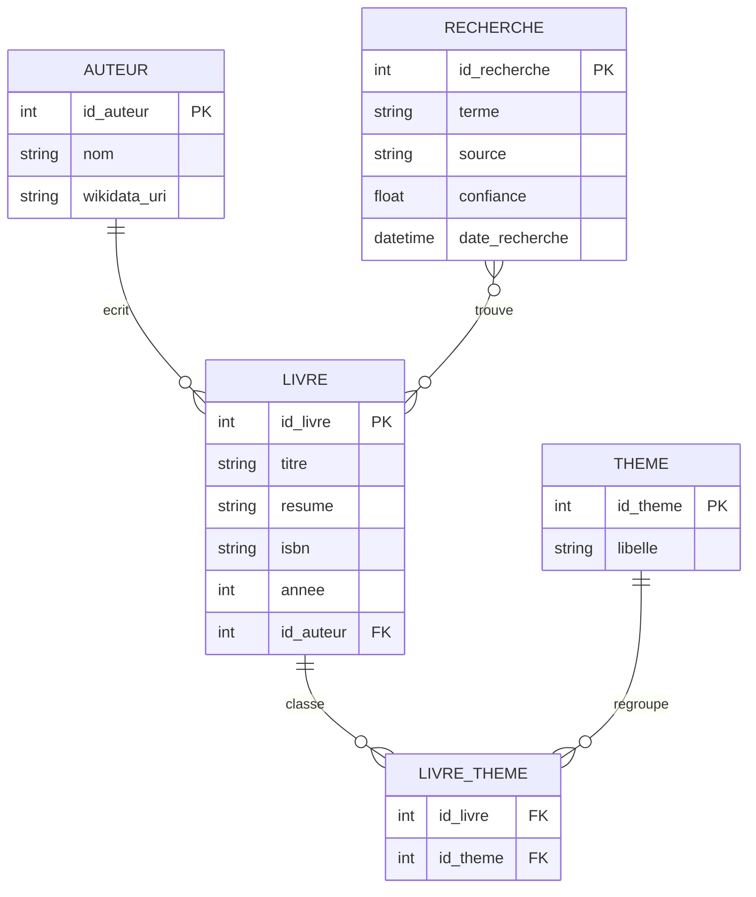

# 📚 Bibliothèque Vocale Intelligente — Recherche par Voix & Narration

> Un site web qui permet la **recherche de livres par commande vocale** et la **narration audio des résumés**, avec liens sémantiques vers **Wikidata** .

---

##  Description

Cette application web propose une interface moderne et accessible pour :
- **Rechercher des livres à la voix** (Web Speech API) et au clavier.
- **Écouter la narration** (Text‑to‑Speech) du titre et du résumé.
- **Relier les auteurs à Wikidata** via des **URI** en **RDF/Turtle**.
- **Consulter/filtrer** par auteur, thème, année.
- **Exporter** les métadonnées de la bibliothèque au format **RDF/Turtle**.

---

##  Public cible

- Étudiants, enseignants, chercheurs  
- Bibliothécaires  
- Personnes malvoyantes (accessibilité audio)

---

##  Technologies utilisées

- **Front‑End** : HTML5, CSS3, **JavaScript** (Web Speech API)
- **Back‑End** : **PHP** (API + pages)
- **Base de données** : **MySQL (SQL)**
- **Données & Web sémantique** : **RDF / Turtle**, JSON
- **Documentation** : **Markdown** (ce README)

---

##  Fonctionnalités

-  **Recherche vocale** (bouton « Parler ») → transcription → recherche SQL
-  **Narration audio** du titre/résumé (Text‑to‑Speech)
-  **Recherche classique** (champ texte) + filtres (auteur, thème, année)
-  **Liens sémantiques** : auteurs liés à Wikidata via URI
-  **Export RDF/Turtle** des livres/auteurs
-  **Journalisation** des requêtes vocales (terme, confiance, date)

---

##  Diagramme entité‑relation (Mermaid)



---

## 🗄️ Schéma SQL minimal

```sql
CREATE TABLE auteur (
  id_auteur INT AUTO_INCREMENT PRIMARY KEY,
  nom VARCHAR(255) NOT NULL,
  wikidata_uri VARCHAR(255) NULL
);

CREATE TABLE livre (
  id_livre INT AUTO_INCREMENT PRIMARY KEY,
  titre VARCHAR(255) NOT NULL,
  resume TEXT,
  isbn VARCHAR(20),
  annee INT,
  id_auteur INT,
  FOREIGN KEY (id_auteur) REFERENCES auteur(id_auteur)
);

CREATE TABLE theme (
  id_theme INT AUTO_INCREMENT PRIMARY KEY,
  libelle VARCHAR(100) NOT NULL
);

CREATE TABLE livre_theme (
  id_livre INT,
  id_theme INT,
  PRIMARY KEY (id_livre, id_theme),
  FOREIGN KEY (id_livre) REFERENCES livre(id_livre),
  FOREIGN KEY (id_theme) REFERENCES theme(id_theme)
);

CREATE TABLE recherche (
  id_recherche INT AUTO_INCREMENT PRIMARY KEY,
  terme VARCHAR(255) NOT NULL,
  source ENUM('voix','texte') NOT NULL,
  confiance DECIMAL(3,2) NULL,
  date_recherche DATETIME DEFAULT CURRENT_TIMESTAMP
);
```

---

##  Exemple RDF / Turtle

```turtle
@prefix ex:   <http://example.org/library#> .
@prefix wd:   <https://www.wikidata.org/entity/> .
@prefix dct:  <http://purl.org/dc/terms/> .
@prefix schema: <http://schema.org/> .

ex:Livre_42 a schema:Book ;
  dct:title "Apprendre le Machine Learning"@fr ;
  schema:isbn "9781234567890" ;
  schema:datePublished "2023" ;
  dct:abstract "Un guide pratique pour débuter en ML avec Python."@fr ;
  schema:author wd:Q37158 .

wd:Q37158 a schema:Person ;
  schema:name "Auteur Exemple"@fr .
```

---

##  Installation

1. **Cloner** le dépôt :
   ```bash
   git clone https://github.com/simohamedK/Bibliotheque-etudiante-Connecte.git
   ```
2. **Créer la base MySQL** et importer `database.sql`.
3. **Configurer la connexion** dans `config.php`.
4. **Lancer un serveur local PHP** :
   ```bash
   php -S localhost:8000
   ```
5. **Ouvrir** `http://localhost:8000` dans le navigateur.

---

##  Licence & Auteur

- **Auteur** : Kamli Mohamed — M2 THYP, Université Paris 8 — 2025  

---
